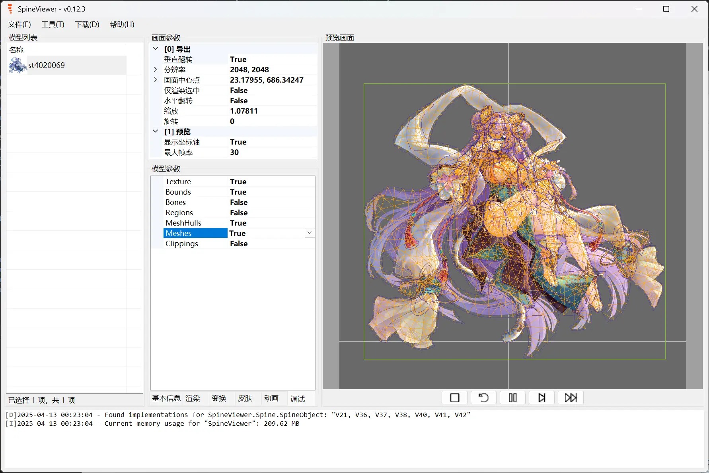

# [SpineViewer](https://github.com/ww-rm/SpineViewer)

  
  

[中文](README.md) | [English](README.en.md)

A *WYSIWYG* Spine file viewer & exporter.

## Features

- Supports multiple Spine file versions  
- Drag & drop or copy/paste to open files in batch  
- List-based skeleton view with render layer management  
- Multi-select list to batch-adjust skeleton parameters  
- Multi-track animation support  
- Skin / custom slot attachment configuration  
- Debug rendering mode  
- Fullscreen preview  
- Export to single-frame image, animated GIF/WebP/AVIF, video formats  
- Batch export at multiple resolutions  
- Custom FFmpeg export parameters  
- …and more

### Spine Version Support

| Version  | View & Export | Format Conversion | Version Conversion |
| :------: | :-----------: | :---------------: | :----------------: |
| `2.1.x`  | :white_check_mark:            |                   |                    |
| `3.6.x`  | :white_check_mark:            |                   |                    |
| `3.7.x`  | :white_check_mark:            |                   |                    |
| `3.8.x`  | :white_check_mark:            | :white_check_mark: |                    |
| `4.0.x` | :white_check_mark: |  |  |
| `4.1.x`  | :white_check_mark:            |                   |                    |
| `4.2.x`  | :white_check_mark:            | :white_check_mark: |                    |
| `4.3.x`  |               |                   |                    |

More versions coming soon 🚀🚀🚀

### Supported Export Formats

| Export Format         | Use Case                                                                                  |
| --------------------- | ----------------------------------------------------------------------------------------- |
| Single Frame          | Generate high‑resolution still images; pick any frame manually.                           |
| Frame Sequence (PNG)  | Lossless PNG sequences with alpha channel preserved.                                      |
| GIF / WebP / AVIF     | Perfect for quick animated previews.                                                      |
| MP4                   | The most widely compatible video format.                                                  |
| WebM                  | Browser‑friendly streaming with optional transparency.                                     |
| MKV / MOV             | For those who like to tinker.                                                             |
| Custom FFmpeg Command | Use any FFmpeg arguments for complex, tailored export workflows.                          |

## Installation

1. Go to the [Releases](https://github.com/ww-rm/SpineViewer/releases) page and download the ZIP.  
2. Make sure you have the [.NET Desktop Runtime 8.0.x](https://dotnet.microsoft.com/download/dotnet/8.0) installed.  
3. Alternatively, download the `SelfContained` ZIP, which runs standalone without any .NET prerequisites.  
4. To export GIF or other video formats, install the `ffmpeg` CLI and add it to your PATH.  
   - Windows builds: see the [FFmpeg download page](https://ffmpeg.org/download.html#build-windows)  
   - Direct download: [ffmpeg-release-full.7z](https://www.gyan.dev/ffmpeg/builds/ffmpeg-release-full.7z)

## Usage

### Importing Skeletons

You can import Spine skeletons in three ways:

- Drag & drop or paste skeleton files or folders onto the model list.  
- Use **File > Open** to batch‑open multiple skeleton files.  
- Use **File > Open Single Model** to open one at a time.

### Adjusting Content

- Right‑click menu and keyboard shortcuts are available in the model list. You can multi‑select to adjust parameters in batch.  
- In the preview pane, you can also use mouse controls:
  - **Left‑click & drag** to move a model; hold **Ctrl** to multi‑select (synced with the list).  
  - **Right‑click & drag** to pan the entire scene.  
  - **Mouse wheel** to zoom; hold **Ctrl** to zoom all selected models proportionally.  
  - **“Render Selected Only”** mode shows only the selected models in preview; use the list to change selection.

Below the preview, playback controls let you scrub through the timeline like a basic player.

### Exporting Content

Exports follow the “what you see is what you get” principle—your real‑time preview is exactly what gets exported.

Key export options:

- **Render Selected Only**: includes only the selected models in both preview and export.  
- **Output Folder**: if unspecified, exports go into each model’s source folder; otherwise, everything exports to the chosen folder.  
- **Export Single**: by default, each model is exported separately; enable this to render all selected models together into a single output.  
- **Auto Resolution**: ignores preview resolution and viewport size—exports at the content’s actual bounds; for animations, matches the full animation area.

## More

Detailed usage and advanced tips are in the [Wiki](https://github.com/ww-rm/SpineViewer/wiki).  
Encounter a bug or have a feature request? Open an [Issue](https://github.com/ww-rm/SpineViewer/issues).

## Acknowledgements

- [spine-runtimes](https://github.com/EsotericSoftware/spine-runtimes)  
- [SFML.Net](https://github.com/SFML/SFML.Net)  
- [FFMpegCore](https://github.com/rosenbjerg/FFMpegCore)

---

If you find this project useful, please give it a ⭐ and share it with others!  

