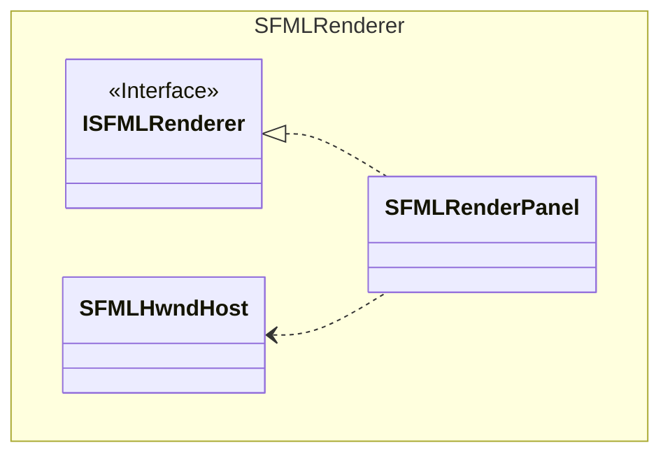

# SFMLRenderer

这个库封装了一个用于 WPF 的 SFML 渲染控件.

```mermaid
classDiagram

namespace SFMLRenderer {
    class ISFMLRenderer {
        <<Interface>>
    }

    class SFMLHwndHost

    class SFMLRenderPanel
}

ISFMLRenderer <|.. SFMLRenderPanel
SFMLHwndHost <.. SFMLRenderPanel

```
