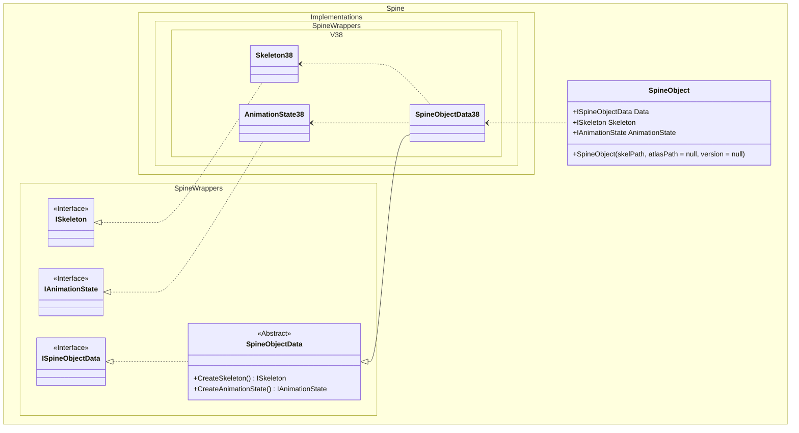
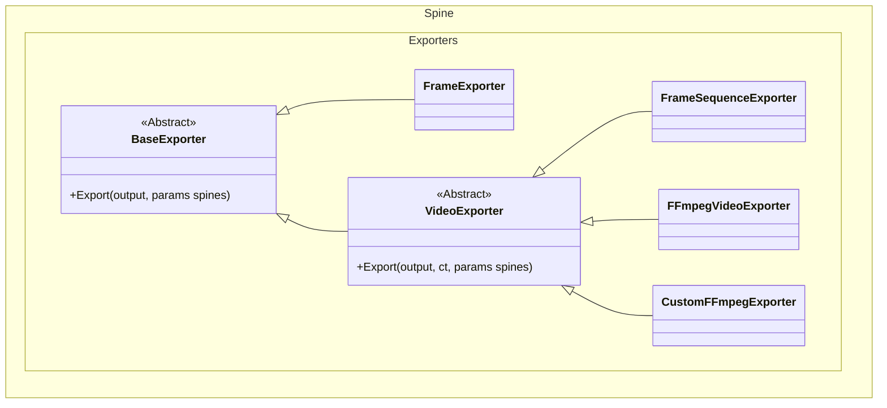

# Spine

这个库封装了与 Spine 有关的底层功能, 下图给出主要关系.

## 如何扩展渲染支持的版本

在命名空间 `Spine.Implementations.SpineWrappers` 下, 增加扩展版本的子命名空间, 例如 `V38`.

随后实现 `SpineObjectData38`, 并继承自 `Spine.SpineWrappers.SpineObjectData`.

并在实现类上使用特性注解 `[SpineImplementation(3, 8)]`.
